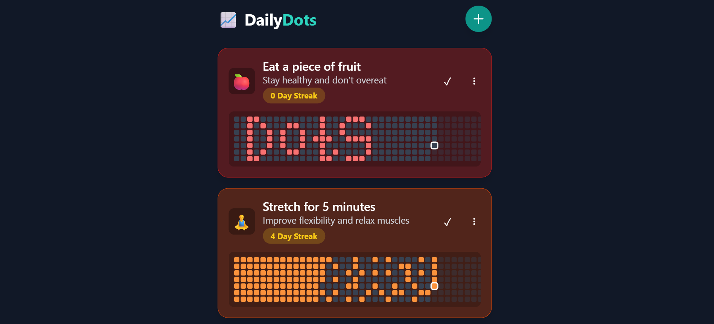

# DailyDots

**DailyDots** is a minimal, clean habit tracker.  
It helps you build daily streaks using a simple grid of progress dots, one dot at a time.

## ✨ Features

- ✅ Add, edit, and delete daily habits
- 🗓️ Visualize progress with an easy grid of dots
- 🔥 Keep your streaks alive
- 🎨 Custom colors for each habit
- 📱 Fully responsive and minimal design

## 📸 Preview

## ⚙️ Tech Stack

- **React**
- **Tailwind CSS**
- **Babel Standalone (for quick local dev)**
- No backend — all data is in-memory for now

